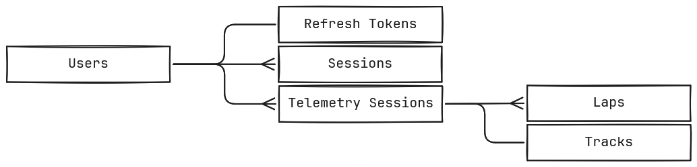
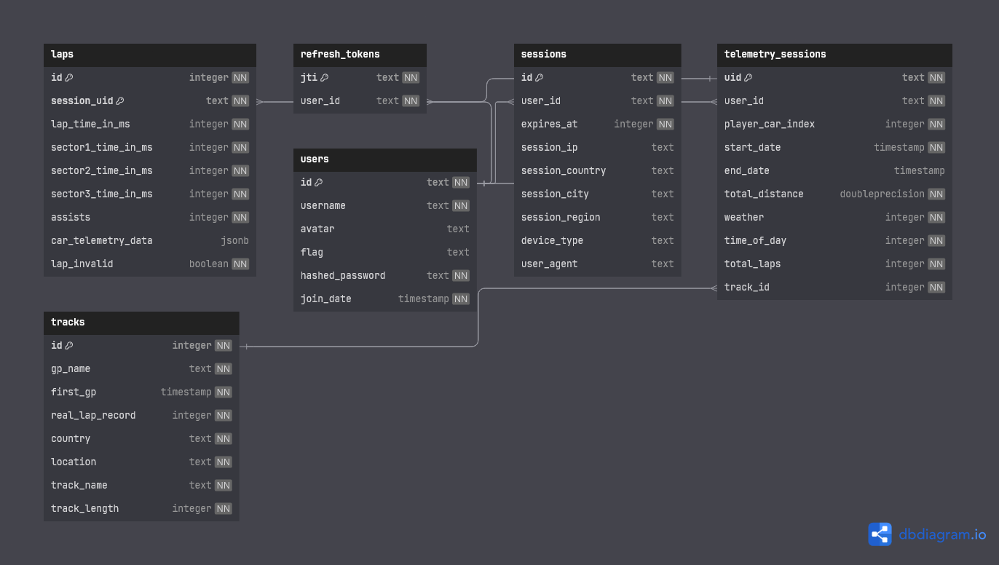

# Entities

## Entity Relationship Diagram

This entity relationship diagram depicts the relationship between the different tables in my proposed solution.

- Each user in the users table has a single refresh token in the refresh_tokens table, which is deleted/replaced whenever a user rotates one.
- Each user has many sessions in the sessions table, which stores authentication information such as when the session expires, and metadata about the device the session is on.
- A user can have many sessions because they can authenticate on many different devices at once.
- A user also has many telemetry sessions because each time they move to a new track or start a new time trial session in-game, the program creates a new session on the database.
    - A telemetry session contains general data about the session such as how many laps have been driven, the weather, the total distance driven etc.
- Each of these sessions is associated with a single track in the database which contains information such as the country, track name and grand prix name.
- A telemetry session also has many laps which contain the lap time information for each sector, overall lap time, detailed telemetry data for the lap, assist information etc.

## Entity Attribute Model

This expanded version of the entity relationship diagram shows each column on the tables.
